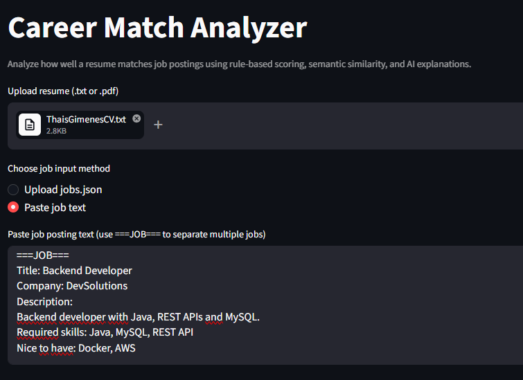
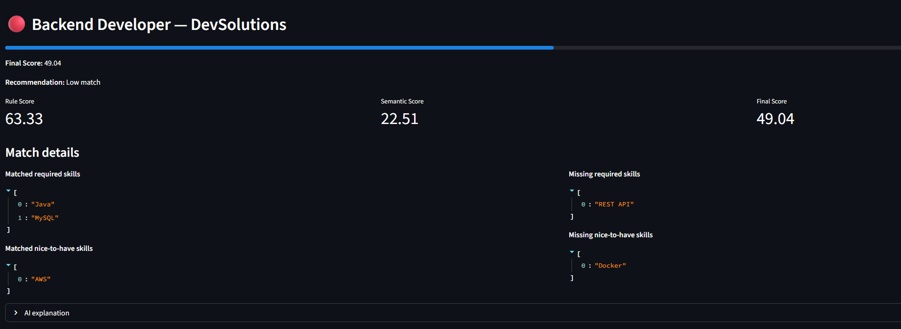

# 🚀 Career Match Analyzer

AI-powered tool to analyze how well a resume matches job opportunities.

This project combines **rule-based scoring**, **semantic similarity (embeddings)** and **LLM explanations** to help candidates prioritize job applications more effectively.

---

## 📌 Overview

The Career Match Analyzer helps users:

- Upload a resume (TXT or PDF)
- Analyze multiple job postings
- Identify best-fit opportunities
- Understand skill gaps
- Get AI-generated explanations of match quality

---

## 🧠 Features

### ✅ Resume Processing
- Supports `.txt` and `.pdf`
- Extracts relevant skills using regex + normalization
- Handles aliases (e.g. "Postgres" → "PostgreSQL")

### 📊 Job Matching Engine
Rule-based scoring:
  - Required skills (weighted higher)
  - Nice-to-have skills
- Semantic similarity using embeddings (`sentence-transformers`)
- Final hybrid score:

```bash
Final Score = 65% rule-based + 35% semantic
```

### 🤖 AI Explanations
Uses LLM (OpenAI) to:
- Explain match quality
- Highlight strengths
- Identify skill gaps
- Suggest whether to apply

### 🖥️ Interactive UI
- Built with Streamlit
- Upload resume
- Paste jobs or upload JSON
- View ranked results
- Expand AI explanations

---

## 🧱 Project Evolution

### 🥇 Version 1 — MVP (Rule-Based Engine)

Initial implementation:

- Resume input via `.txt`
- Jobs input via `jobs.json`
- Basic skill extraction (keyword matching)
- Rule-based scoring system
- Ranking of job matches

🔧 Technologies:
- Python
- JSON
- Basic string matching

---

### 🥈 Version 2 — Improved NLP + UX

Enhancements:

- Regex-based skill extraction
- Skill normalization and aliases
- PDF resume support (`pypdf`)
- Improved scoring logic
- Streamlit UI (first version)

🔧 Technologies:
- Regex
- Streamlit
- pypdf

---

### 🥉 Version 3 — AI + Semantic Matching

Major upgrade:

- Semantic similarity using embeddings
- Hybrid scoring model
- AI-generated explanations using LLM
- Improved UI (cards, metrics, progress bars)

🔧 Technologies:
- sentence-transformers
- scikit-learn
- OpenAI API

---

## 📂 Project Structure
```bash
career-match-analyzer/
│
├── assets/
│   ├── input.png
|   └── results.png
├── data/
│ ├── jobs.json
│ └── sample_resume.txt
│
├── results/
│ └── matches.json
│
├── src/
│ ├── app.py # Streamlit interface
│ ├── main.py # CLI version
│ ├── matcher.py # Rule-based scoring
│ ├── semantic_matcher.py # Embedding similarity
│ ├── parser.py # Resume + job parsing
│ ├── skill_config.py # Skill patterns & aliases
│ └── llm_explainer.py # AI explanations
│
├── requirements.txt
└── README.md
```


---

## ▶️ How to Run

### 1. Clone the repository

```bash
git clone https://github.com/your-username/career-match-analyzer.git
cd career-match-analyzer
```
2. Install dependencies
   
```bash
pip install -r requirements.txt
```
3. Set OpenAI API Key (optional for AI explanations)

```bash
$env:OPENAI_API_KEY="your_api_key_here"
```
4. Run the app

```bash
streamlit run src/app.py
```

## 🧪 Example Inputs
Resume
TXT or PDF file
Jobs

You can:

Upload a JSON file
OR
Paste jobs in structured text format:

```bash
===JOB===
Title: Data Engineer
Company: TechCorp
Description:
Looking for a Data Engineer with Python, SQL and AWS.
Required skills: Python, SQL, AWS
Nice to have: Airflow, Spark
```

## 📊 Example Output

For each job:

Final Score
- Recommendation (High / Medium / Low)
- Matched skills
- Missing skills
- Rule score vs Semantic score
- AI explanation
  
## 🧠 Scoring Logic
Rule-Based Score
- Required skills → 80% weight
- Nice-to-have → 20% weight
Semantic Score
- Cosine similarity between:
- Resume text
- Job description
Final Score
```bash
Final Score = 0.65 * Rule Score + 0.35 * Semantic Score
```
## 🚧 Future Improvements
- Automatic job parsing from raw text (LinkedIn, etc)
- Resume optimization suggestions
- Job scraping integration
- Application tracking system
- Model fine-tuning for better matching
- Caching LLM responses (cost optimization)

---

## 🎯 Why This Project Matters

This project demonstrates:

- Real-world NLP application
- Hybrid AI systems (rules + embeddings + LLM)
- Data processing pipeline
- Product thinking (UX + usability)
- End-to-end system design

--- 

## 👩‍💻 Author

Thaís Fernanda Gimenes
Data Engineer | AI Enthusiast

---

## ⭐ If you like this project

Give it a star on GitHub ⭐

---
## 🖼️ Demo

Below is an example of the application analyzing a resume against job postings, showing skill matching, scoring, and recommendations.

### 📥 Input


### 📊 Results

